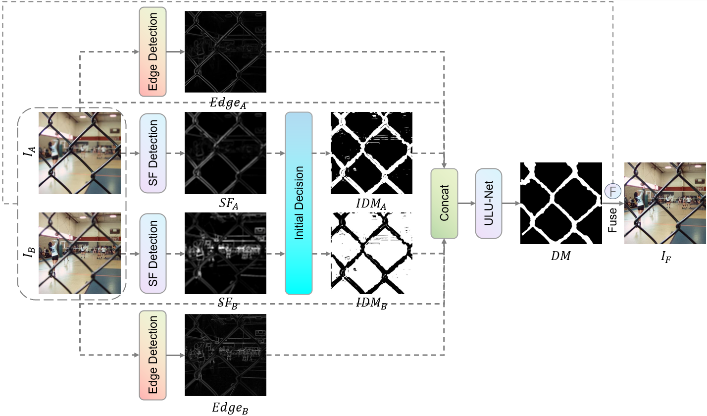
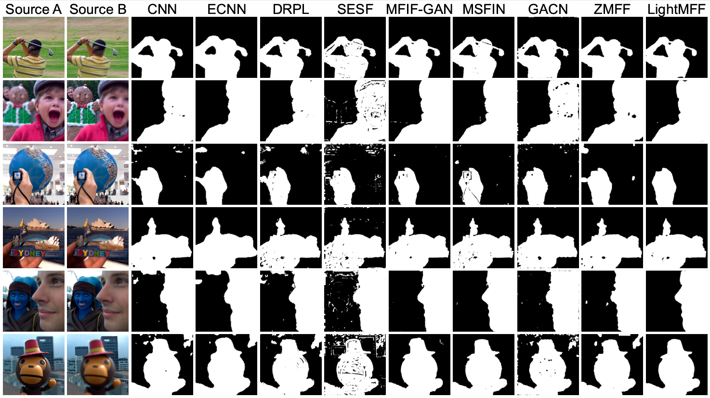

# LightMFF 🚀
[](https://pytorch.org/)
[](https://opensource.org/licenses/MIT)
[](https://www.python.org/downloads/)
[](https://github.com/Xinzhe99/LightMFF)

> 🔔 **Note**: Our paper is accepted by Applied Sciences.

<div align="center">
    
</div>

## 📝 Introduction

This is the official implementation of the paper "LightMFF: A Simple and Efficient Ultra-lightweight Multi-focus Image Fusion Network". LightMFF is an ultra-lightweight multi-focus image fusion network with the following features:

- 🚄 **Real-time Performance**: Only 0.02 seconds processing time per image pair
- 🎯 **Ultra-lightweight**: Only 0.02M parameters and 0.06G FLOPs
- 🏆 **High Performance**: Surpasses existing methods across standard fusion quality metrics
- 💡 **Innovative Approach**: Reformulates the fusion problem from a classification perspective into a refinement approach

## 🛠️ Installation

```bash
git clone https://github.com/Xinzhe99/LightMFF.git
cd LightMFF
pip install -r requirements.txt
```

## 📥 Pre-trained Model and rusults

Download the pre-trained model from:
```bash
https://pan.baidu.com/s/1mTouAcH-cGMr6VgDCqcWaw?pwd=cite
```

Download the rusults of Lytro, MFFW, MFI-WHU datasets.
```bash
https://pan.baidu.com/s/1VT2MP96DShAIjdUJoo4ViQ?pwd=cite
```

## 🚀 Quick Start

### Inference
```bash
python predict.py --model_path [model path] --test_dataset_path [dataset path] --GPU_parallelism [True/False]
```
Note: There should be two folders under the dataset path named A and B, which store the corresponding image pairs (1.jpg, 2.jpg...)

### Creating Training Data
```bash
# Create training set
python tools/make_datasets_DUTS.py --mode TR --data_root [data_root] --out_dir_name [DUTS_MFF_NEW_256]
# Create validation set
python tools/make_datasets_DUTS.py --mode TE --data_root [data_root] --out_dir_name [DUTS_MFF_NEW_256]
```
Note: You should download the DUTS dataset first. There should be three folders under [data_root]: DUTS-OURS, DUTS-TR, DUTS-TE.
- Download: http://saliencydetection.net/duts/

## 📊 Results

<div align="center">
    
</div>

### Quantitative Results on Lytro Dataset

<div align="center">
<table>
<thead>
<tr>
<th>Method</th>
<th>Q<sup>AB/F</sup>↑</th>
<th>Q<sub>MI</sub>↑</th>
<th>Q<sup>P</sup>↑</th>
<th>Q<sub>W</sub>↑</th>
<th>Q<sub>E</sub>↑</th>
<th>Q<sub>CB</sub>↑</th>
</tr>
</thead>
<tbody>
<tr>
<td colspan="7" align="center"><b>Methods based on image transform domain</b></td>
</tr>
<tr>
<td>DWT</td>
<td>0.6850</td>
<td>0.8677</td>
<td>0.2878</td>
<td>0.8977</td>
<td>0.8356</td>
<td>0.6117</td>
</tr>
<tr>
<td>DTCWT</td>
<td>0.6929</td>
<td>0.8992</td>
<td>0.2925</td>
<td>0.8987</td>
<td>0.8408</td>
<td>0.6234</td>
</tr>
<tr>
<td>NSCT</td>
<td>0.6901</td>
<td>0.9039</td>
<td>0.2928</td>
<td>0.9030</td>
<td>0.8413</td>
<td>0.6174</td>
</tr>
<tr>
<td>CVT</td>
<td>0.7243</td>
<td>0.8968</td>
<td>0.7966</td>
<td>0.9388</td>
<td>0.9023</td>
<td>0.7277</td>
</tr>
<tr>
<td>DCT</td>
<td>0.7031</td>
<td>0.9383</td>
<td>0.7825</td>
<td>0.9093</td>
<td>0.8073</td>
<td>0.6624</td>
</tr>
<tr>
<td>GFF</td>
<td>0.6998</td>
<td>1.0020</td>
<td>0.2952</td>
<td>0.8982</td>
<td>0.8351</td>
<td>0.6518</td>
</tr>
<tr>
<td>SR</td>
<td>0.6944</td>
<td>1.0003</td>
<td>0.2921</td>
<td>0.8984</td>
<td>0.8309</td>
<td>0.6406</td>
</tr>
<tr>
<td>ASR</td>
<td>0.6951</td>
<td>1.0024</td>
<td>0.2926</td>
<td>0.8986</td>
<td>0.8308</td>
<td>0.6413</td>
</tr>
<tr>
<td>MWGF</td>
<td>0.7037</td>
<td>1.0545</td>
<td>0.3176</td>
<td>0.8913</td>
<td>0.8107</td>
<td>0.6758</td>
</tr>
<tr>
<td>ICA</td>
<td>0.6766</td>
<td>0.8687</td>
<td>0.2964</td>
<td>0.9084</td>
<td>0.8219</td>
<td>0.5956</td>
</tr>
<tr>
<td>NSCT-SR</td>
<td>0.6995</td>
<td>1.0189</td>
<td>0.2949</td>
<td>0.9000</td>
<td>0.8385</td>
<td>0.6501</td>
</tr>
<tr>
<td colspan="7" align="center"><b>Methods based on image spatial domain</b></td>
</tr>
<tr>
<td>SSSDI</td>
<td>0.6966</td>
<td>1.0351</td>
<td>0.2915</td>
<td>0.8961</td>
<td>0.8279</td>
<td>0.6558</td>
</tr>
<tr>
<td>QUADTREE</td>
<td>0.7027</td>
<td>1.0630</td>
<td>0.2940</td>
<td>0.8962</td>
<td>0.8265</td>
<td>0.6681</td>
</tr>
<tr>
<td>DSIFT</td>
<td>0.7046</td>
<td>1.0642</td>
<td>0.2954</td>
<td>0.8977</td>
<td>0.8354</td>
<td>0.6675</td>
</tr>
<tr>
<td>SRCF</td>
<td>0.7036</td>
<td>1.0590</td>
<td>0.2954</td>
<td>0.8978</td>
<td>0.8369</td>
<td>0.6669</td>
</tr>
<tr>
<td>GFDF</td>
<td>0.7049</td>
<td>1.0524</td>
<td>0.2974</td>
<td>0.8989</td>
<td>0.8399</td>
<td>0.6657</td>
</tr>
<tr>
<td>BRW</td>
<td>0.7040</td>
<td>1.0516</td>
<td>0.2964</td>
<td>0.8984</td>
<td>0.8371</td>
<td>0.6650</td>
</tr>
<tr>
<td>MISF</td>
<td>0.6984</td>
<td>1.0391</td>
<td>0.2945</td>
<td>0.8929</td>
<td>0.8063</td>
<td>0.6607</td>
</tr>
<tr>
<td>MDLSR_RFM</td>
<td>0.7518</td>
<td>1.1233</td>
<td>0.8294</td>
<td>0.9394</td>
<td>0.9021</td>
<td><i>0.8064</i></td>
</tr>
<tr>
<td colspan="7" align="center"><b>End-to-end methods based on deep learning</b></td>
</tr>
<tr>
<td>IFCNN-MAX</td>
<td>0.6784</td>
<td>0.8863</td>
<td>0.2962</td>
<td>0.9013</td>
<td>0.8324</td>
<td>0.5986</td>
</tr>
<tr>
<td>U2Fusion</td>
<td>0.6190</td>
<td>0.7803</td>
<td>0.2994</td>
<td>0.8909</td>
<td>0.7108</td>
<td>0.5159</td>
</tr>
<tr>
<td>SDNet</td>
<td>0.6441</td>
<td>0.8464</td>
<td>0.3072</td>
<td>0.8934</td>
<td>0.7464</td>
<td>0.5739</td>
</tr>
<tr>
<td>MFF-GAN</td>
<td>0.6222</td>
<td>0.7930</td>
<td>0.2840</td>
<td>0.8887</td>
<td>0.7660</td>
<td>0.5399</td>
</tr>
<tr>
<td>SwinFusion</td>
<td>0.6597</td>
<td>0.8404</td>
<td>0.3117</td>
<td>0.9011</td>
<td>0.7460</td>
<td>0.5745</td>
</tr>
<tr>
<td>MUFusion</td>
<td>0.6614</td>
<td>0.8030</td>
<td>0.7160</td>
<td>0.9089</td>
<td>0.8036</td>
<td>0.6758</td>
</tr>
<tr>
<td>FusionDiff</td>
<td>0.6744</td>
<td>0.8692</td>
<td>0.2900</td>
<td>0.8980</td>
<td>0.8261</td>
<td>0.5747</td>
</tr>
<tr>
<td>SwinMFF</td>
<td>0.7321</td>
<td>0.9605</td>
<td>0.8222</td>
<td>0.9390</td>
<td>0.8986</td>
<td>0.7543</td>
</tr>
<tr>
<td>DDBFusion</td>
<td>0.5026</td>
<td>0.8152</td>
<td>0.5610</td>
<td>0.8391</td>
<td>0.4947</td>
<td>0.6057</td>
</tr>
<tr>
<td colspan="7" align="center"><b>Decision map-based methods using deep learning</b></td>
</tr>
<tr>
<td>CNN</td>
<td>0.7019</td>
<td>1.0424</td>
<td>0.2968</td>
<td>0.8976</td>
<td>0.8311</td>
<td>0.6628</td>
</tr>
<tr>
<td>ECNN</td>
<td>0.7030</td>
<td>1.0723</td>
<td>0.2945</td>
<td>0.8946</td>
<td>0.8169</td>
<td>0.6698</td>
</tr>
<tr>
<td>DRPL</td>
<td>0.7574</td>
<td>1.1405</td>
<td>0.8435</td>
<td>0.9397</td>
<td><i>0.9060</i></td>
<td>0.8035</td>
</tr>
<tr>
<td>SESF</td>
<td>0.7031</td>
<td>1.0524</td>
<td>0.2950</td>
<td>0.8977</td>
<td>0.8353</td>
<td>0.6657</td>
</tr>
<tr>
<td>MFIF-GAN</td>
<td>0.7029</td>
<td>1.0618</td>
<td>0.2960</td>
<td>0.8982</td>
<td>0.8395</td>
<td>0.6660</td>
</tr>
<tr>
<td>MSFIN</td>
<td>0.7045</td>
<td>1.0601</td>
<td>0.2973</td>
<td>0.8990</td>
<td>0.8436</td>
<td>0.6664</td>
</tr>
<tr>
<td>GACN</td>
<td><i>0.7581</i></td>
<td><i>1.1334</i></td>
<td><i>0.8443</i></td>
<td><b>0.9405</b></td>
<td>0.9013</td>
<td>0.8024</td>
</tr>
<tr>
<td>ZMFF</td>
<td>0.6635</td>
<td>0.8694</td>
<td>0.2890</td>
<td>0.8951</td>
<td>0.8253</td>
<td>0.6136</td>
</tr>
<tr>
<td><b>LightMFF</b></td>
<td><b>0.7588</b></td>
<td><b>1.1462</b></td>
<td><b>0.8450</b></td>
<td><i>0.9400</i></td>
<td><b>0.9061</b></td>
<td><b>0.8067</b></td>
</tr>
</tbody>
</table>
</div>

### Computational Efficiency Comparison

<div align="center">
<table>
<thead>
<tr>
<th>Method</th>
<th>Model Size (M)</th>
<th>FLOPs (G)</th>
<th>Time (s)</th>
<th>Device</th>
</tr>
</thead>
<tbody>
<tr>
<td colspan="5" align="center"><b>End-to-end methods based on deep learning</b></td>
</tr>
<tr>
<td>IFCNN-MAX</td>
<td>0.08</td>
<td>8.54</td>
<td>0.09</td>
<td>GPU</td>
</tr>
<tr>
<td>U2Fusion</td>
<td>0.66</td>
<td>86.40</td>
<td>0.16</td>
<td>GPU</td>
</tr>
<tr>
<td>SDNet</td>
<td>0.07</td>
<td>8.81</td>
<td>0.10</td>
<td>GPU</td>
</tr>
<tr>
<td>MFF-GAN</td>
<td>0.05</td>
<td>3.08</td>
<td>0.06</td>
<td>GPU</td>
</tr>
<tr>
<td>SwinFusion</td>
<td>0.93</td>
<td>63.73</td>
<td>1.79</td>
<td>GPU</td>
</tr>
<tr>
<td>MUFusion</td>
<td>2.16</td>
<td>24.07</td>
<td>0.72</td>
<td>GPU</td>
</tr>
<tr>
<td>FusionDiff</td>
<td>26.90</td>
<td>58.13</td>
<td>81.47</td>
<td>GPU</td>
</tr>
<tr>
<td>SwinMFF</td>
<td>41.25</td>
<td>22.38</td>
<td>0.46</td>
<td>GPU</td>
</tr>
<tr>
<td>DDBFusion</td>
<td>10.92</td>
<td>184.93</td>
<td>1.69</td>
<td>GPU</td>
</tr>
<tr>
<td colspan="5" align="center"><b>Decision map-based methods using deep learning</b></td>
</tr>
<tr>
<td>CNN</td>
<td>8.76</td>
<td>142.23</td>
<td>0.06</td>
<td>GPU</td>
</tr>
<tr>
<td>ECNN</td>
<td>1.59</td>
<td>14.93</td>
<td>125.53</td>
<td>GPU</td>
</tr>
<tr>
<td>DRPL</td>
<td>1.07</td>
<td>140.49</td>
<td>0.22</td>
<td>GPU</td>
</tr>
<tr>
<td>SESF</td>
<td>0.07</td>
<td>4.90</td>
<td>0.26</td>
<td>GPU</td>
</tr>
<tr>
<td>MFIF-GAN</td>
<td>3.82</td>
<td>693.03</td>
<td>0.32</td>
<td>GPU</td>
</tr>
<tr>
<td>MSFIN</td>
<td>4.59</td>
<td>26.76</td>
<td>1.10</td>
<td>GPU</td>
</tr>
<tr>
<td>GACN</td>
<td>0.07</td>
<td>10.89</td>
<td>0.16</td>
<td>GPU</td>
</tr>
<tr>
<td>ZMFF</td>
<td>6.33</td>
<td>464.53</td>
<td>165.38</td>
<td>GPU</td>
</tr>
<tr>
<td><b>LightMFF</b></td>
<td><b>0.02</b></td>
<td><b>0.06</b></td>
<td><b>0.02</b></td>
<td>GPU</td>
</tr>
<tr>
<td>Reduction (%)</td>
<td>60.00</td>
<td>98.05</td>
<td>66.67</td>
<td>-</td>
</tr>
</tbody>
</table>
</div>

## ⚠️ Training Notes

If you want to train LightMFF yourself, please note:
- You need to comment out all codes in the original training script that visualize fusion results
- The original code will save fusion results of Lytro, MFI-WHU, and MFFW during the training process
- You need to prepare these datasets or comment out all related codes

## 📚 Citation

If our work is helpful to you, please cite our paper.

## 📄 License

This project is licensed under the MIT License. See the [LICENSE](LICENSE) file for details.

## 🤝 Contributing

Issues and contributions are welcome! Feel free to submit issues or pull requests.
